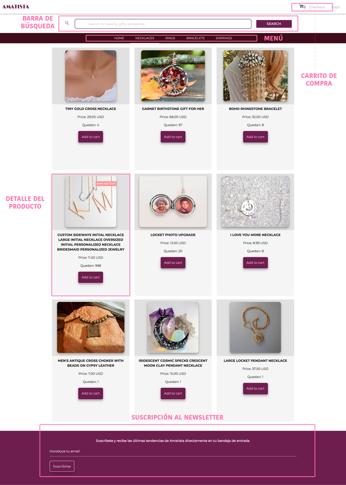

# AMATISTA ECOMMERCE
-----

Esta aplicación es una ecommerce dedicada a la venta de joyeria.
Al ser una api con un gran número de productos, delimitamos nuestra solicitud sólo a joyería.

## CATEGORÍAS

1. Necklaces
2. Rings
3. Bracelets
4. Earrings

## CONSTRUCCIÓN DEL ENDPOINT

Para hacer la llamada a la api construimos el endpoint restinguiendo la búsqueda sólo a productos que tuvieran la keyword "jewelry". Incluimos a la petición una imagen principal "MainImage" y 3 images más que pudieran complementar el detalle del producto.

ENDPOINT:
https://openapi.etsy.com/v2/listings/active?keywords=jewelry&includes=MainImage,Images:3&limit=&category=jewelry&api_key=wsx5gs9dbm720tz6pzr1a3pl`

## COMPONENTES DEL SITIO

En base a las categorias anteriores construyó la siguiente barra de tabs:

.

## IMAGES PRODUCTS
Una vez que  se accede a cierta categoría se mostraran las imágenes de varios
productos, llamados con un ENDPOINT y de los cuales se toma el titulo, descripción,
y precio. También se le agrega un botón a cada tarjeta el cual permite agregar al
carrito, y cambia de color cuando ya está agregado.

## CHECKOUT VIEW
Ya seleccionados los productos que deseamos comprar se pasa a la tab checkout y
 se muestra lo que hay dentro del carrito de compras y se da la opción de pagar
 con PAYPAL:

.

## NEWSLETTER
De igual manera se cuenta con una sección de NEWSLETTER en el cual si te suscribes
te llegan notificaciones con las últimas tendencias directamente a la bandeja
de tu correo.

Desarrollado para
------
_Laboratoria_
